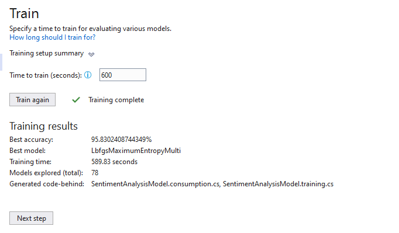

# SentimentAnalysisWebapp

## Sentiment_v1.txt

### start nni training

||Trainer|MicroAccuracy|MacroAccuracy|Duration|#Iteration|
|---|---|---|---|---|---|
|1|SdcaMaximumEntropyMulti|0.8559|0.2733|1.9|1|
|2|SdcaLogisticRegressionOva|0.8559|0.2733|3.3|2|
|3|SdcaMaximumEntropyMulti|0.8559|0.2733|0.9|3|
|4|SdcaMaximumEntropyMulti|0.8559|0.2733|0.9|4|
|5|SdcaLogisticRegressionOva|0.8559|0.2733|3.2|5|
|6|LbfgsLogisticRegressionOva|0.8588|0.2800|4.8|6|
|7|SdcaMaximumEntropyMulti|0.8559|0.2733|0.9|7|
|8|FastForestOva|0.8443|0.2769|8.4|8|
|9|SdcaMaximumEntropyMulti|0.8559|0.2733|0.9|9|
|10|FastTreeOva|0.8559|0.2733|6.4|10|
|11|SdcaMaximumEntropyMulti|0.8559|0.2733|0.9|11|
|12|LbfgsLogisticRegressionOva|0.8559|0.2733|3.5|12|
|13|SdcaLogisticRegressionOva|0.8559|0.2733|3.3|13|
|14|LightGbmMulti|0.8559|0.2733|2.3|14|
|15|FastTreeOva|0.8559|0.2733|6.2|15|
|16|SdcaMaximumEntropyMulti|0.8559|0.2733|1.0|16|
|17|SdcaMaximumEntropyMulti|0.8559|0.2733|1.0|17|
|18|SdcaMaximumEntropyMulti|0.8559|0.2733|1.0|18|
|19|FastTreeOva|0.8518|0.3071|7.3|19|
|20|SdcaMaximumEntropyMulti|0.8559|0.2733|0.9|20|
|21|SdcaMaximumEntropyMulti|0.8559|0.2733|0.9|21|
|22|SdcaLogisticRegressionOva|0.8559|0.2733|3.3|22|
|23|SdcaLogisticRegressionOva|0.8559|0.2733|3.4|23|
|24|LbfgsMaximumEntropyMulti|0.8559|0.2733|2.1|24|
|25|SdcaLogisticRegressionOva|0.8559|0.2733|3.4|25|
|26|LbfgsMaximumEntropyMulti|0.8559|0.2733|1.6|26|
|27|SdcaMaximumEntropyMulti|0.8559|0.2733|1.0|27|
|28|LbfgsMaximumEntropyMulti|0.8588|0.2800|3.7|28|
|29|SdcaMaximumEntropyMulti|0.8559|0.2733|1.0|29|
|30|FastTreeOva|0.8559|0.2733|7.7|30|
|31|LbfgsMaximumEntropyMulti|0.8559|0.2733|2.1|31|
|32|LbfgsMaximumEntropyMulti|0.8552|0.2906|6.3|32|
|33|LbfgsMaximumEntropyMulti|0.8559|0.2733|2.3|33|
|34|SdcaMaximumEntropyMulti|0.8559|0.2733|1.0|34|

### Experiment Results

|Summary|
|---|
|ML Task: Classification|
|Dataset: D:\Github\GetShopeeReviews\sentiments_v1.txt|
|Label : rating_star|
|Total experiment time : 98.11 Secs|
|Total number of models explored: 33|

Top 5 models explored
||Trainer|MicroAccuracy|MacroAccuracy|Duration|#Iteration|
|---|---|---|---|---|---|
|27|LbfgsMaximumEntropyMulti|0.8588|0.2800|3.7|27|
|5|LbfgsLogisticRegressionOva|0.8588|0.2800|4.8|5|
|32|LbfgsMaximumEntropyMulti|0.8559|0.2733|2.3|32|
|15|SdcaMaximumEntropyMulti|0.8559|0.2733|1.0|15|
|1|SdcaLogisticRegressionOva|0.8559|0.2733|3.3|1|
------------------------------------------------------------------------------------------------------------------

## Sentiment_v2.txt

### start nni training

|#|Trainer|MicroAccuracy|MacroAccuracy|Duration|#Iteration|
|---|---|---|---|---|---|
|1|SdcaMaximumEntropyMulti|0.9389|0.2000|4.4|1|
|2|LightGbmMulti|0.9389|0.2000|3.9|2|
|3|SdcaMaximumEntropyMulti|0.9389|0.2000|2.4|3|
|4|SdcaMaximumEntropyMulti|0.9389|0.2000|2.4|4|
|5|FastTreeOva|0.9379|0.1998|7.1|5|
|6|FastForestOva|0.9379|0.3205|14.9|6|
|7|SdcaLogisticRegressionOva|0.9389|0.2000|8.0|7|
|8|LbfgsMaximumEntropyMulti|0.9718|0.6645|4.9|8|
|9|SdcaMaximumEntropyMulti|0.9389|0.2000|2.5|9|
|10|FastTreeOva|0.9389|0.2284|9.8|10|
|11|SdcaLogisticRegressionOva|0.9389|0.2000|8.2|11|
|12|FastForestOva|0.9407|0.2647|11.9|12|
|13|LbfgsMaximumEntropyMulti|0.9426|0.2966|3.6|13|
|14|LbfgsLogisticRegressionOva|0.9389|0.2218|10.2|14|
|15|LightGbmMulti|0.9389|0.2000|4.0|15|

### Experiment Results

|Summary|
|---|
|ML Task: Classification|
|Dataset: D:\Github\GetShopeeReviews\sentiments_v2.txt|
|Label : rating_star|
|Total experiment time : 98.22 Secs|
|Total number of models explored: 15|
------------------------------------------------------------------------------------------------------------------

Top 5 models explored
||Trainer|MicroAccuracy|MacroAccuracy|Duration|#Iteration|
|---|---|---|---|---|---|
|7|LbfgsMaximumEntropyMulti|0.9718|0.6645|4.9|7|
|12|LbfgsMaximumEntropyMulti|0.9426|0.2966|3.6|12|
|11|FastForestOva|0.9407|0.2647|11.9|11|
|14|LightGbmMulti|0.9389|0.2000|4.0|14|
|13|LbfgsLogisticRegressionOva|0.9389|0.2218|10.2|13|

## Sentiment_v3.txt

### start nni training

||Trainer|MicroAccuracy|MacroAccuracy|Duration|#Iteration|
|---|---|---|---|---|---|
|1|SdcaMaximumEntropyMulti|0.9582|0.2000|5.0|1|
|2|LbfgsLogisticRegressionOva|0.9582|0.2005|6.8|2|
|3|LightGbmMulti|0.9582|0.2000|4.7|3|
|4|LbfgsMaximumEntropyMulti|0.9582|0.2000|4.6|4|
|5|FastForestOva|0.9540|0.2142|19.0|5|
|6|FastTreeOva|0.9582|0.2000|8.2|6|
|7|LightGbmMulti|0.9470|0.2157|6.1|7|
|8|SdcaLogisticRegressionOva|0.9582|0.2000|10.1|8|
|9|SdcaMaximumEntropyMulti|0.9582|0.2000|6.4|9|
|10|SdcaLogisticRegressionOva|0.9582|0.2000|11.5|10|
|11|LbfgsLogisticRegressionOva|0.9582|0.2005|9.0|11|
|12|SdcaMaximumEntropyMulti|0.9582|0.2000|3.8|12|
|13|SdcaMaximumEntropyMulti|0.9582|0.2000|4.3|13|
|14|FastTreeOva|0.9562|0.2100|9.6|14|
|15|LbfgsLogisticRegressionOva|0.9582|0.2000|5.0|15|
|16|SdcaMaximumEntropyMulti|0.9582|0.2000|3.8|16|
|17|SdcaMaximumEntropyMulti|0.9582|0.2000|3.8|17|
|18|LbfgsMaximumEntropyMulti|0.9583|0.2031|8.4|18|
|19|SdcaLogisticRegressionOva|0.9582|0.2000|9.4|19|
|20|LbfgsMaximumEntropyMulti|0.9582|0.2000|10.9|20|
|21|SdcaMaximumEntropyMulti|0.9582|0.2000|4.6|21|
|22|FastTreeOva|0.9578|0.2009|7.8|22|
|23|FastTreeOva|0.9582|0.2000|9.7|23|
|24|SdcaLogisticRegressionOva|0.9582|0.2000|9.2|24|
|25|FastTreeOva|0.9580|0.2005|10.6|25|
|26|SdcaMaximumEntropyMulti|0.9582|0.2000|3.8|26|
|27|SdcaMaximumEntropyMulti|0.9582|0.2000|4.8|27|
|28|LbfgsMaximumEntropyMulti|0.9577|0.2112|6.4|28|
|29|SdcaMaximumEntropyMulti|0.9582|0.2000|4.2|29|
|30|LbfgsLogisticRegressionOva|0.9580|0.2005|9.9|30|
|31|FastTreeOva|0.9581|0.2052|9.7|31|
|32|SdcaLogisticRegressionOva|0.9582|0.2000|13.8|32|
|33|SdcaMaximumEntropyMulti|0.9582|0.2000|4.4|33|
|34|SdcaMaximumEntropyMulti|0.9582|0.2000|3.9|34|
|35|SdcaMaximumEntropyMulti|0.9582|0.2000|4.7|35|
|36|FastTreeOva|0.9582|0.2000|10.6|36|
|37|SdcaLogisticRegressionOva|0.9582|0.2000|9.7|37|
|38|SdcaMaximumEntropyMulti|0.9582|0.2000|4.0|38|
|39|FastTreeOva|0.9568|0.2096|7.9|39|
|40|FastForestOva|0.9555|0.2081|19.6|40|
|41|LbfgsLogisticRegressionOva|0.9582|0.2000|5.3|41|
|42|FastTreeOva|0.9582|0.2000|18.3|42|
|43|SdcaMaximumEntropyMulti|0.9582|0.2000|3.9|43|
|44|LbfgsMaximumEntropyMulti|0.9559|0.2114|15.5|44|
|45|SdcaMaximumEntropyMulti|0.9582|0.2000|3.8|45|
|46|SdcaMaximumEntropyMulti|0.9582|0.2000|4.0|46|
|47|FastTreeOva|0.9568|0.2065|8.2|47|
|48|LbfgsLogisticRegressionOva|0.9583|0.2005|8.7|48|
|49|LbfgsLogisticRegressionOva|0.9582|0.2000|6.4|49|
|50|SdcaMaximumEntropyMulti|0.9582|0.2000|3.9|50|
|51|SdcaMaximumEntropyMulti|0.9582|0.2000|3.8|51|
|52|SdcaLogisticRegressionOva|0.9582|0.2000|10.0|52|
|53|SdcaLogisticRegressionOva|0.9582|0.2000|9.8|53|
|54|SdcaLogisticRegressionOva|0.9582|0.2000|10.3|54|
|55|SdcaMaximumEntropyMulti|0.9582|0.2000|3.9|55|
|56|FastTreeOva|0.9582|0.2000|19.3|56|
|57|LbfgsLogisticRegressionOva|0.9578|0.2035|10.9|57|
|58|SdcaMaximumEntropyMulti|0.9582|0.2000|4.0|58|
|59|LightGbmMulti|0.9582|0.2000|4.1|59|
|60|LightGbmMulti|0.9582|0.2000|3.9|60|
|61|LightGbmMulti|0.9582|0.2000|6.2|61|
|62|SdcaLogisticRegressionOva|0.9582|0.2000|9.7|62|
|63|SdcaLogisticRegressionOva|0.9582|0.2000|9.4|63|
|64|FastTreeOva|0.9579|0.2030|8.3|64|
|65|SdcaMaximumEntropyMulti|0.9582|0.2000|3.8|65|
|66|LightGbmMulti|0.9582|0.2000|6.4|66|
|67|SdcaLogisticRegressionOva|0.9582|0.2000|9.3|67|
|68|SdcaLogisticRegressionOva|0.9582|0.2000|9.3|68|
|69|SdcaMaximumEntropyMulti|0.9582|0.2000|3.8|69|
|70|LightGbmMulti|0.9582|0.2000|4.1|70|
|71|SdcaMaximumEntropyMulti|0.9582|0.2000|4.2|71|
|72|SdcaLogisticRegressionOva|0.9582|0.2000|9.5|72|
|73|SdcaLogisticRegressionOva|0.9582|0.2000|9.5|73|
|74|SdcaMaximumEntropyMulti|0.9582|0.2000|4.1|74|
|75|SdcaMaximumEntropyMulti|0.9582|0.2000|4.3|75|
|76|LightGbmMulti|0.9582|0.2000|5.8|76|
|77|LightGbmMulti|0.9582|0.2000|4.1|77|
|78|SdcaLogisticRegressionOva|0.9582|0.2000|10.1|78|

### Experiment Results

|Summary|
|---|
|ML Task: Classification|
|Dataset: D:\Github\GetShopeeReviews\sentiments_v3.txt|
|Label : col2|
|Total experiment time : 589.83 Secs|
|Total number of models explored: 78|

Top 5 models explored
||Trainer|MicroAccuracy|MacroAccuracy|Duration|#Iteration|
|---|---|---|---|---|---|
|47|LbfgsLogisticRegressionOva|0.9583|0.2005|8.7|47|
|17|LbfgsMaximumEntropyMulti|0.9583|0.2031|8.4|17|
|77|SdcaLogisticRegressionOva|0.9582|0.2000|10.1|77|
|32|SdcaMaximumEntropyMulti|0.9582|0.2000|4.4|32|
|23|SdcaLogisticRegressionOva|0.9582|0.2000|9.2|23|
