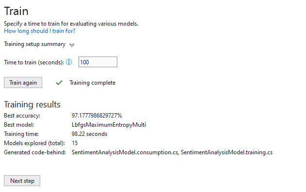

# SentimentAnalysisWebapp

## Sentiment_v1.txt

### start nni training

||Trainer|MicroAccuracy|MacroAccuracy|Duration|#Iteration|
|---|---|---|---|---|---|
|1 |SdcaMaximumEntropyMulti| 0.9219| 0.2000| 3.5| 1|
|2 |SdcaMaximumEntropyMulti| 0.9219| 0.2000| 2.5| 2|
|3 |SdcaLogisticRegressionOva| 0.9219| 0.2000| 8.1| 3|
|4 |LightGbmMulti| 0.9219| 0.2000| 5.9| 4|
|5 |FastTreeOva| 0.9144| 0.2529| 8.6| 5|
|6 |SdcaMaximumEntropyMulti| 0.9219| 0.2000| 3.6| 6|
|7 |FastForestOva| 0.9238| 0.2727|26.4| 7|
|8 |LbfgsMaximumEntropyMulti | 0.9229| 0.2100| 6.0| 8|
|9 |SdcaMaximumEntropyMulti| 0.9219| 0.2000| 3.3| 9|
|10|SdcaLogisticRegressionOva| 0.9219| 0.2000| 9.0|10|

### Experiment Results

|Summary|
|---|
|ML Task: Classification |
|Dataset: D:\Github\GetShopeeReviews\sentiments_v2.txt |
|Label : rating_star |
|Total experiment time : 76.96 Secs|
|Total number of models explored: 10 |

Top 5 models explored
| |Trainer|MicroAccuracy| MacroAccuracy|Duration|#Iteration|
|---|---|---|---|---|---|
| TrainerMicroAccuracyMacroAccuracyDuration #Iteration |
|6FastForestOva 0.9238 0.272726.46 |
|7LbfgsMaximumEntropyMulti0.9229 0.2100 6.07 |
|9SdcaLogisticRegressionOva 0.9219 0.2000 9.09 |
|8SdcaMaximumEntropyMulti 0.9219 0.2000 3.38 |
|5SdcaMaximumEntropyMulti 0.9219 0.2000 3.65 |

## Sentiment_v2.txt

### start nni training

|# |Trainer|MicroAccuracy|MacroAccuracy|Duration|#Iteration|
|---|---|---|---|---|---|
|1 |SdcaMaximumEntropyMulti| 0.9219| 0.2000| 3.5| 1|
|2 |SdcaMaximumEntropyMulti| 0.9219| 0.2000| 2.5| 2|
|3 |SdcaLogisticRegressionOva| 0.9219| 0.2000| 8.1| 3|
|4 |LightGbmMulti| 0.9219| 0.2000| 5.9| 4|
|5 |FastTreeOva| 0.9144| 0.2529| 8.6| 5|
|6 |SdcaMaximumEntropyMulti| 0.9219| 0.2000| 3.6| 6|
|7 |FastForestOva| 0.9238| 0.2727|26.4| 7|
|8 |LbfgsMaximumEntropyMulti | 0.9229| 0.2100| 6.0| 8|
|9 |SdcaMaximumEntropyMulti| 0.9219| 0.2000| 3.3| 9|
|10|SdcaLogisticRegressionOva| 0.9219| 0.2000| 9.0|10|

### Experiment Results

|Summary|
|---|
|ML Task: Classification |
|Dataset: D:\Github\GetShopeeReviews\sentiments_v2.txt |
|Label : rating_star |
|Total experiment time : 76.96 Secs|
|Total number of models explored: 10 |
------------------------------------------------------------------------------------------------------------------

Top 5 models explored
|---|---|---|---|---|---|
| |Trainer|MicroAccuracy| MacroAccuracy|Duration|#Iteration|
|6|FastForestOva| 0.9238|0.2727|26.4| 6|
|7|LbfgsMaximumEntropyMulti | 0.9229|0.2100| 6.0| 7|
|9|SdcaLogisticRegressionOva| 0.9219|0.2000| 9.0| 9|
|8|SdcaMaximumEntropyMulti| 0.9219|0.2000| 3.3| 8|
|5|SdcaMaximumEntropyMulti| 0.9219|0.2000| 3.6| 5|
