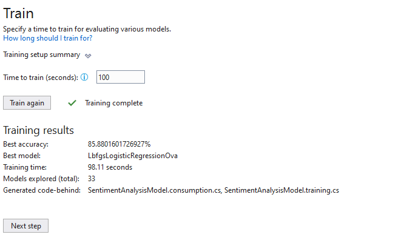

# SentimentAnalysisWebapp

## Sentiment_v1.txt

### start nni training

||Trainer|MicroAccuracy|MacroAccuracy|Duration|#Iteration|
|---|---|---|---|---|---|
|1|SdcaMaximumEntropyMulti|0.8559|0.2733|1.9|1|
|2|SdcaLogisticRegressionOva|0.8559|0.2733|3.3|2|
|3|SdcaMaximumEntropyMulti|0.8559|0.2733|0.9|3|
|4|SdcaMaximumEntropyMulti|0.8559|0.2733|0.9|4|
|5|SdcaLogisticRegressionOva|0.8559|0.2733|3.2|5|
|6|LbfgsLogisticRegressionOva|0.8588|0.2800|4.8|6|
|7|SdcaMaximumEntropyMulti|0.8559|0.2733|0.9|7|
|8|FastForestOva|0.8443|0.2769|8.4|8|
|9|SdcaMaximumEntropyMulti|0.8559|0.2733|0.9|9|
|10|FastTreeOva|0.8559|0.2733|6.4|10|
|11|SdcaMaximumEntropyMulti|0.8559|0.2733|0.9|11|
|12|LbfgsLogisticRegressionOva|0.8559|0.2733|3.5|12|
|13|SdcaLogisticRegressionOva|0.8559|0.2733|3.3|13|
|14|LightGbmMulti|0.8559|0.2733|2.3|14|
|15|FastTreeOva|0.8559|0.2733|6.2|15|
|16|SdcaMaximumEntropyMulti|0.8559|0.2733|1.0|16|
|17|SdcaMaximumEntropyMulti|0.8559|0.2733|1.0|17|
|18|SdcaMaximumEntropyMulti|0.8559|0.2733|1.0|18|
|19|FastTreeOva|0.8518|0.3071|7.3|19|
|20|SdcaMaximumEntropyMulti|0.8559|0.2733|0.9|20|
|21|SdcaMaximumEntropyMulti|0.8559|0.2733|0.9|21|
|22|SdcaLogisticRegressionOva|0.8559|0.2733|3.3|22|
|23|SdcaLogisticRegressionOva|0.8559|0.2733|3.4|23|
|24|LbfgsMaximumEntropyMulti|0.8559|0.2733|2.1|24|
|25|SdcaLogisticRegressionOva|0.8559|0.2733|3.4|25|
|26|LbfgsMaximumEntropyMulti|0.8559|0.2733|1.6|26|
|27|SdcaMaximumEntropyMulti|0.8559|0.2733|1.0|27|
|28|LbfgsMaximumEntropyMulti|0.8588|0.2800|3.7|28|
|29|SdcaMaximumEntropyMulti|0.8559|0.2733|1.0|29|
|30|FastTreeOva|0.8559|0.2733|7.7|30|
|31|LbfgsMaximumEntropyMulti|0.8559|0.2733|2.1|31|
|32|LbfgsMaximumEntropyMulti|0.8552|0.2906|6.3|32|
|33|LbfgsMaximumEntropyMulti|0.8559|0.2733|2.3|33|
|34|SdcaMaximumEntropyMulti|0.8559|0.2733|1.0|34|

### Experiment Results

|Summary|
|---|
|ML Task: Classification|
|Dataset: D:\Github\GetShopeeReviews\sentiments_v1.txt|
|Label : rating_star|
|Total experiment time : 98.11 Secs|
|Total number of models explored: 33|

Top 5 models explored
||Trainer|MicroAccuracy|MacroAccuracy|Duration|#Iteration|
|---|---|---|---|---|---|
|27|LbfgsMaximumEntropyMulti|0.8588|0.2800|3.7|27|
|5|LbfgsLogisticRegressionOva|0.8588|0.2800|4.8|5|
|32|LbfgsMaximumEntropyMulti|0.8559|0.2733|2.3|32|
|15|SdcaMaximumEntropyMulti|0.8559|0.2733|1.0|15|
|1|SdcaLogisticRegressionOva|0.8559|0.2733|3.3|1|
------------------------------------------------------------------------------------------------------------------

## Sentiment_v2.txt

### start nni training

|#|Trainer|MicroAccuracy|MacroAccuracy|Duration|#Iteration|
|---|---|---|---|---|---|
|1|SdcaMaximumEntropyMulti|0.9389|0.2000|4.4|1|
|2|LightGbmMulti|0.9389|0.2000|3.9|2|
|3|SdcaMaximumEntropyMulti|0.9389|0.2000|2.4|3|
|4|SdcaMaximumEntropyMulti|0.9389|0.2000|2.4|4|
|5|FastTreeOva|0.9379|0.1998|7.1|5|
|6|FastForestOva|0.9379|0.3205|14.9|6|
|7|SdcaLogisticRegressionOva|0.9389|0.2000|8.0|7|
|8|LbfgsMaximumEntropyMulti|0.9718|0.6645|4.9|8|
|9|SdcaMaximumEntropyMulti|0.9389|0.2000|2.5|9|
|10|FastTreeOva|0.9389|0.2284|9.8|10|
|11|SdcaLogisticRegressionOva|0.9389|0.2000|8.2|11|
|12|FastForestOva|0.9407|0.2647|11.9|12|
|13|LbfgsMaximumEntropyMulti|0.9426|0.2966|3.6|13|
|14|LbfgsLogisticRegressionOva|0.9389|0.2218|10.2|14|
|15|LightGbmMulti|0.9389|0.2000|4.0|15|

### Experiment Results

|Summary|
|---|
|ML Task: Classification|
|Dataset: D:\Github\GetShopeeReviews\sentiments_v2.txt|
|Label : rating_star|
|Total experiment time : 98.22 Secs|
|Total number of models explored: 15|
------------------------------------------------------------------------------------------------------------------

Top 5 models explored
||Trainer|MicroAccuracy|MacroAccuracy|Duration|#Iteration|
|---|---|---|---|---|---|
|7|LbfgsMaximumEntropyMulti|0.9718|0.6645|4.9|7|
|12|LbfgsMaximumEntropyMulti|0.9426|0.2966|3.6|12|
|11|FastForestOva|0.9407|0.2647|11.9|11|
|14|LightGbmMulti|0.9389|0.2000|4.0|14|
|13|LbfgsLogisticRegressionOva|0.9389|0.2218|10.2|13|
